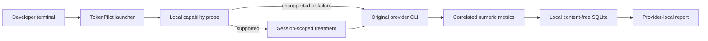

# TokenPilot

[](https://github.com/cesaremcasa/tokenpilot/actions/workflows/ci.yml)
[](https://www.npmjs.com/package/tokenpilot)
[](LICENSE)
[](https://nodejs.org/)
[](docs/INSTALLATION.md)

**Local-first token measurement and optimization for AI coding CLIs — without proxying traffic or storing prompts.**

TokenPilot 0.5.0 is a public beta for the terminal versions of Claude Code, OpenAI Codex, Grok Build, and Kimi Code CLI. It measures provider-published numeric usage, applies version-gated efficiency treatments where supported, and reports cache-aware comparisons without reading credentials, prompts, responses, source code, tool output, command arguments, or working directories.

TokenPilot is created by **Cesar Augusto / Mycellium Lab**, released under the [MIT License](LICENSE), and is not affiliated with Anthropic, OpenAI, xAI, or Moonshot AI.

## Quick start

Install at least one supported provider CLI first and confirm that it works normally. TokenPilot wraps existing provider commands; it does not install or authenticate them.

```sh
npm install -g tokenpilot
tokenpilot install
tokenpilot doctor
```

Open a new terminal before starting a provider session so the TokenPilot shims are first on `PATH`.

```sh
codex

# Latest provider-local cache-aware result and evidence state.
tokenpilot report --provider codex

# Original provider CLI, with no TokenPilot treatment or measurement.
TOKENPILOT_BYPASS=1 codex
```

The installer creates user-owned `tokenpilot`, `claude`, `codex`, `grok`, and `kimi` launchers under `~/.tokenpilot/bin` and installs optional report skills only when their destination is safe. It never requires root or a second provider login.

See [Installation and lifecycle](docs/INSTALLATION.md) for source installation, upgrades, rollback, and uninstall.

## What TokenPilot measures and changes

TokenPilot keeps new input, cache reads, cache creation, output, reasoning, provider totals, retries, compactions, latency, and content-free outcome labels separate. A complete comparison includes cached input; moving tokens into cache is not automatically called a reduction.

New installations default to `reduce`. Claude, Codex, and Grok receive a versioned session treatment only after the installed CLI advertises the complete required surface. Unsupported capabilities or any setup failure make TokenPilot start the original CLI unchanged.

| Provider | Current behavior | Boundary |
| --- | --- | --- |
| Claude Code | Metrics-only local OTLP; low effort, stable cache prefix, core tools, and a bounded verification pass when supported. | Use `deep`, `off`, or bypass when the complete native tool surface is required. |
| OpenAI Codex | Metrics-only local OTLP; low reasoning and verbosity, body compaction, and bounded batched execution. | Preserves agents, memories, web, apps, and the complete native tool surface. |
| Grok Build | External OTEL or explicit JSON counters; bounded terminal workflow and reduced optional surfaces when supported. | Use `deep`, `off`, or bypass for native agents, memory, web, or plan mode. |
| Kimi Code CLI | Original CLI passthrough. | No treatment or reduction claim until a safe correlated measurement channel exists. |

## Platform and provider support

| Platform | Status |
| --- | --- |
| macOS + Node.js 22.5 or newer | Supported and tested in CI |
| Linux + Node.js 22.5 or newer | Supported and tested in CI |
| Windows native / PowerShell | Not released |

A missing provider never disables the others. `tokenpilot doctor` separates launcher readiness from measurement availability. See the [provider and platform matrix](docs/PROVIDERS.md) for modality and version details.

## Experimental evidence

The first controlled research snapshot was recorded on August 15, 2026, on a Linux test host. These are provider-local, task-specific observed cache-aware changes, not universal promises and not formal quality-equivalence results.

| Provider | Coverage | Observed median change | Cohort change | Median latency change |
| --- | ---: | ---: | ---: | ---: |
| Claude | 45/46 measured | 66.0% less | 66.3% less | 35.3% faster |
| Codex | 49/51 measured | 54.8% less | 55.5% less | 69.0% faster |
| Grok | 39/40 measured | 42.6% less | 50.8% less | 68.4% faster |
| Kimi | 42/46 measured | 51.6% less, historical | 51.5% less, historical | 4.2% faster |

Every percentage above is an experimental observation over the documented cohort. Under the 0.5 evidence contract it remains preliminary until formal quality-equivalence evidence exists. Kimi currently runs unchanged and cannot reproduce its historical measurement.

Review the session counts, totals, limitations, and unavailable sessions in [First research snapshot](docs/RESULTS.md). The [measurement methodology](docs/MEASUREMENT.md) defines every state and formula.

## Evidence states

The concise report returns the most recent comparable provider-local result and preserves its evidence state:

- `variação cache-aware medida — X% a menos (preliminar)` for a directional comparison;
- `variação cache-aware medida — X% a menos (qualidade observada degradada)` when outcome observations worsened;
- `redução cache-aware validada — X% a menos` only with formal quality-equivalence evidence;
- `cache-shift — sem redução comprovada` when the complete total stayed effectively flat; and
- `sem comparação cache-aware medida` for limited or incomparable evidence.

Providers are never combined. Raw totals, latency, USD, and policy details remain in the detailed audit view rather than the skill-facing summary.

## Privacy and fail-open behavior

Raw state stays on the user's machine:

- macOS: `~/.local/share/tokenpilot/telemetry.sqlite`
- Linux: `~/.tokenpilot/data/telemetry.sqlite`

The database stores content-free session metadata and numeric counters only. TokenPilot does not scan provider histories, transcripts, logs, JSONL files, repositories, or credential stores. Receivers bind to loopback, accept narrowly defined numeric metrics, and discard provider attributes and content.

If executable validation, capability probing, treatment setup, collection, or storage fails before submission, TokenPilot starts the original provider CLI unchanged. `TOKENPILOT_BYPASS=1` bypasses both treatment and measurement immediately.

Read [Security](SECURITY.md) and [Architecture](docs/ARCHITECTURE.md) before deploying TokenPilot in an organization.

## Architecture



TokenPilot does not proxy provider traffic, control provider authentication, or create a shared cache.

## Controls

```sh
tokenpilot mode reduce    # treatment on every supported session; default
tokenpilot mode balanced  # alternating observe/treatment experiment
tokenpilot mode observe   # unchanged provider behavior with measurement
tokenpilot mode deep      # native provider settings with measurement
tokenpilot mode off       # original provider with no TokenPilot telemetry

tokenpilot sessions --unclassified
tokenpilot classify <run-id> --kind research --outcome completed

tokenpilot report --provider claude
tokenpilot report --view detail
tokenpilot report --view diagnostics
```

Authentication and support commands such as login, logout, help, version, and update pass through without creating telemetry.

## Verified releases

GitHub release artifacts are generated twice from the committed lockfile and must be byte-identical. Each release includes an npm tarball, SHA-256 manifest, and deterministic CycloneDX SBOM.

```sh
npm ci --ignore-scripts
npm run build
npm run release:artifact -- --output release-artifacts
shasum -a 256 -c release-artifacts/tokenpilot-0.5.0.tgz.sha256
cat release-artifacts/tokenpilot-0.5.0.cdx.json
```

The release smoke installs that exact tarball into a temporary npm consumer, executes the staged runtime after removing the consumer package, and uninstalls the temporary launchers.

## Documentation and contribution

- [Installation, upgrade, rollback, and uninstall](docs/INSTALLATION.md)
- [Architecture and data flow](docs/ARCHITECTURE.md)
- [Measurement methodology](docs/MEASUREMENT.md)
- [Provider and model compatibility](docs/PROVIDERS.md)
- [First research snapshot](docs/RESULTS.md)
- [Troubleshooting](docs/TROUBLESHOOTING.md)
- [Enterprise adoption](docs/ENTERPRISE.md)
- [Security policy](SECURITY.md)
- [Contributing](CONTRIBUTING.md)
- [Changelog](CHANGELOG.md)

Focused, privacy-preserving contributions are welcome. Open an issue before adding a provider adapter, telemetry source, persistent field, or treatment policy.

## Public beta status

TokenPilot 0.5.0 is active research software. Provider CLIs and telemetry surfaces can change, and unsupported or uncorrelated sessions are reported as unavailable rather than estimated. Use the bypass controls whenever a task requires untouched native behavior.

## License

Copyright © 2026 Cesar Augusto and Mycellium Lab. TokenPilot is available under the [MIT License](LICENSE).

## Security audit

Audited by Codex Security on August 15, 2026. The public beta includes hardening for local endpoint authentication, managed-state permissions, provider executable resolution, loopback receiver admission control, reproducible artifacts, and content-free reporting.
