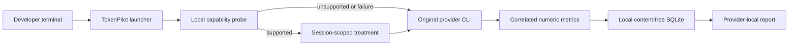

# TokenPilot

[](https://github.com/cesaremcasa/tokenpilot/actions/workflows/ci.yml)
[](https://www.npmjs.com/package/@cesaremcasa/tokenpilot)
[](LICENSE)
[](https://nodejs.org/)
[](docs/INSTALLATION.md)

**Local-first token measurement and optimization for AI coding CLIs — without proxying traffic or storing prompts.**

TokenPilot 0.5.2 is a public beta for the terminal versions of Claude Code, OpenAI Codex, Grok Build, and Kimi Code CLI. It measures provider-published numeric usage, applies version-gated efficiency treatments where supported, and reports per-session cache percentages without storing credentials, prompts, responses, source code, or tool output. Supported live numeric streams are parsed transiently; provider histories and credential stores are not scanned.

TokenPilot is created by **Cesar Augusto / Mycellium Lab**, released under the [MIT License](LICENSE), and is not affiliated with Anthropic, OpenAI, xAI, or Moonshot AI.

## Quick start

Install at least one supported provider CLI first and confirm that it works normally. TokenPilot wraps existing provider commands; it does not install or authenticate them.

```sh
npm install -g @cesaremcasa/tokenpilot
tokenpilot install
tokenpilot doctor
```

Open a new terminal before starting a provider session so the TokenPilot shims are first on `PATH`.

```sh
codex --model gpt-5.5

# Verified cache percentages for this session, or the latest recent session.
tokenpilot report --provider codex

# Original provider CLI, with no TokenPilot treatment or measurement.
TOKENPILOT_BYPASS=1 codex
```

The installer creates user-owned `tokenpilot`, `claude`, `codex`, `grok`, and `kimi` launchers under `~/.tokenpilot/bin` and installs optional report skills only when their destination is safe. It never requires root or a second provider login.

See [Installation and lifecycle](docs/INSTALLATION.md) for source installation, upgrades, rollback, and uninstall.

## What TokenPilot measures and changes

TokenPilot keeps new input, cache reads, cache creation, output, reasoning, provider totals, retries, compactions, latency, and content-free outcome labels separate. A complete comparison includes cached input; moving tokens into cache is not automatically called a reduction.

New installations default to `reduce`. Claude, Codex, and Grok receive a versioned session treatment only after the installed CLI advertises the complete required surface. Unsupported capabilities or any setup failure make TokenPilot start the original CLI unchanged.

| Provider | Current behavior | Boundary |
| --- | --- | --- |
| Claude Code | Metrics-only local OTLP; low effort, stable cache prefix, core tools, and a bounded verification pass when supported. | Use `deep`, `off`, or bypass when the complete native tool surface is required. |
| OpenAI Codex | Metrics-only local OTLP or explicit `exec --json` usage; model-specific, versioned treatments. | Preserves all native capabilities; explicit model selection is required for treatment. |
| Grok Build | External OTEL or explicit JSON counters; low reasoning and concise appended guidance. | Preserves the native tools, memory, web, subagents, and plan mode. |
| Kimi Code CLI | Original CLI passthrough. | No treatment or reduction claim until a safe correlated measurement channel exists. |

## Platform and provider support

| Platform | Status |
| --- | --- |
| macOS + Node.js 22.13.0 or 23.4.0+ | Supported and tested in CI |
| Linux + Node.js 22.13.0 or 23.4.0+ | Supported and tested in CI |
| Windows native / PowerShell | Not released |

A missing provider never disables the others. `tokenpilot doctor` separates launcher readiness from measurement availability. See the [provider and platform matrix](docs/PROVIDERS.md) for modality and version details.

## Experimental evidence

The [reduction retest](docs/REDUCTION-RETEST-2026-10-05.md) documents the final model-specific policies and every rejected experiment. An increase rejects a policy and requires investigation and a predeclared retest.

The [October 5 real-model evaluation](docs/EVALUATION-2026-10-05.md) records 24 calls across eight Codex and four Grok models, with source-qualified counters and independently checked patches.

Current measurements must come from real provider sessions with a known total basis and independently checked task outcomes. A single matched task is an observed comparison, not validated reduction or a general performance claim.

The [August 2026 research snapshot](docs/RESULTS.md) is retained as historical documentation. Its aggregate figures have not been revalidated under the current Codex/Grok counter semantics and are not current performance evidence. See the [measurement methodology](docs/MEASUREMENT.md).

## Skills and validation

See [agent skill installation and invocation](docs/SKILLS.md) and [CI versus distribution status](docs/CI_CD.md). Grok Bot cloud installation and Claude authentication are separate from local CLI installation.

## Current measured reductions

The [October 6 real-run results](docs/REAL_RESULTS_2026-10-06.md) report verified total-input-plus-output reductions for nine tested OpenAI models. Six reached 42%; three did not. These are controlled-task observations, not session cache percentages or a universal guarantee.

The [October 6 Grok Build results](docs/GROK_RESULTS_2026-10-06.md) record real reductions across all four available models, with equivalent validated results. These CLI measurements do not establish savings for the parent Grok Bot.

## Session cache percentages

The CLI and provider skills show `Approximate reduction in uncached input: X% (cache reuse) · Uncached input: Y%`, with the session ID and date. Output is excluded; cache creation is not a cache hit. Numeric counters stay internal rather than appearing in the concise display.

Inside a wrapped agent, the opaque run context selects that exact session. Outside it, the latest session in the requested window is selected (seven days by default). Missing telemetry never falls back to an older session or an experiment result: it reports `Percentage unavailable`.

Approximate uncached-input reduction compares reused input with the same session's total input, assuming no reuse. It does not mean fewer total billed tokens or establish how much reduction TokenPilot caused. Historical A/B comparisons remain in the technical JSON data. Kimi stays unavailable until a supported correlated numeric channel exists.

## Privacy and fail-open behavior

Raw state stays on the user's machine:

- macOS: `~/.local/share/tokenpilot/telemetry.sqlite`
- Linux: `~/.tokenpilot/data/telemetry.sqlite`

The database stores content-free session metadata and numeric counters only. TokenPilot does not scan provider histories, transcripts, logs, JSONL files, repositories, or credential stores. Receivers bind to loopback, accept narrowly defined numeric metrics, and discard provider attributes and content.

If executable validation, capability probing, treatment setup, collection, or storage fails before submission, TokenPilot starts the original provider CLI unchanged. `TOKENPILOT_BYPASS=1` bypasses both treatment and measurement immediately.

Read [Security](SECURITY.md) and [Architecture](docs/ARCHITECTURE.md) before deploying TokenPilot in an organization.

## Architecture


```mermaid
flowchart LR
    U[Developer terminal] --> L[TokenPilot launcher]
    L --> P[Local capability probe]
    P -->|unsupported or failure| C[Original provider CLI]
    P -->|supported| T[Session-scoped treatment]
    T --> C
    C --> M[Correlated numeric metrics]
    M --> D[Local content-free SQLite]
    D --> R[Provider-local report]
```

TokenPilot does not proxy provider traffic, control provider authentication, or create a shared cache.

## Controls

```sh
tokenpilot mode reduce    # treatment on every supported session; default
tokenpilot mode balanced  # alternating observe/treatment experiment
tokenpilot mode observe   # unchanged provider behavior with measurement
tokenpilot mode deep      # native provider settings with measurement
tokenpilot mode off       # original provider with no TokenPilot telemetry

tokenpilot sessions --unclassified
tokenpilot classify <run-id> --kind research --outcome completed

tokenpilot report --provider claude
tokenpilot report --view detail
tokenpilot report --view diagnostics
```

Authentication and support commands such as login, logout, help, version, and update pass through without creating telemetry.

## Verified releases

GitHub release artifacts are generated twice from the committed lockfile and must be byte-identical. Each release includes an npm tarball, SHA-256 manifest, and deterministic CycloneDX SBOM.

```sh
npm ci --ignore-scripts
npm run build
npm run release:artifact -- --output release-artifacts
shasum -a 256 -c release-artifacts/cesaremcasa-tokenpilot-0.5.1.tgz.sha256
cat release-artifacts/cesaremcasa-tokenpilot-0.5.1.cdx.json
```

The release smoke installs that exact tarball into a temporary npm consumer, executes the staged runtime after removing the consumer package, and uninstalls the temporary launchers.

## Documentation and contribution

- [Installation, upgrade, rollback, and uninstall](docs/INSTALLATION.md)
- [Architecture and data flow](docs/ARCHITECTURE.md)
- [Measurement methodology](docs/MEASUREMENT.md)
- [Provider and model compatibility](docs/PROVIDERS.md)
- [First research snapshot](docs/RESULTS.md)
- [Troubleshooting](docs/TROUBLESHOOTING.md)
- [Enterprise adoption](docs/ENTERPRISE.md)
- [Security policy](SECURITY.md)
- [Contributing](CONTRIBUTING.md)
- [Changelog](CHANGELOG.md)

Focused, privacy-preserving contributions are welcome. Open an issue before adding a provider adapter, telemetry source, persistent field, or treatment policy.

## Public beta status

TokenPilot 0.5.2 is active research software. Provider CLIs and telemetry surfaces can change, and unsupported or uncorrelated sessions are reported as unavailable rather than estimated. Use the bypass controls whenever a task requires untouched native behavior.

## License

Copyright © 2026 Cesar Augusto and Mycellium Lab. TokenPilot is available under the [MIT License](LICENSE).

## Security audit

Audited by Codex Security on August 15, 2026. The public beta includes hardening for local endpoint authentication, managed-state permissions, provider executable resolution, loopback receiver admission control, reproducible artifacts, and content-free reporting.
