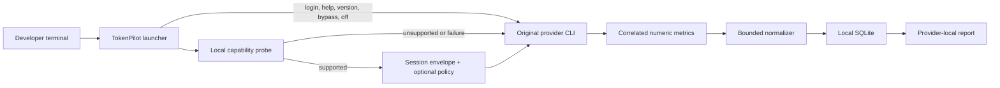

# Architecture

TokenPilot is a per-user terminal layer. It does not sit between a provider CLI and the provider API. Authentication, network traffic, provider caching, conversation storage, and model execution remain owned by the provider CLI.

## Components

### Installer

The installer performs a platform and Node.js preflight, discovers provider executables, creates TokenPilot-owned launchers, updates a marked shell PATH block, copies the compiled runtime into private state, and installs optional report skills. It refuses unsafe ancestors, symlinks, and foreign files.

### Provider launchers

The launchers preserve the user's arguments, stdin, stdout, stderr, TTY behavior, colors, signals, and window resizing. Authentication and support commands pass through without telemetry. The provider executable is resolved outside TokenPilot's launcher directory and must be a trusted regular executable.

### Experiment allocator

`balanced` uses a durable provider-local alternating assignment. The first assignment is random; subsequent sessions alternate `observe` and `balanced`. Assignment happens before optional task classification, so task type cannot influence treatment selection.

### Capability probes and policies

Each policy has a versioned identifier. TokenPilot checks the installed CLI's version and documented help surface before injecting the complete policy. A partial probe never enables a partial treatment.

### Correlated measurement

- Claude: authenticated, metrics-only local OTLP receiver.
- Codex: session-scoped metrics-only OTLP; older `exec` can use only the CLI's final published total.
- Grok: authenticated local External OTEL v1 for supported versions; explicit JSON single-turn fallback for older compatible flows.
- Kimi: runs through the original CLI without TokenPilot measurement until a content-free, child-authenticated channel is available.

Receivers bind to loopback and accept only narrowly defined numeric metrics. Unknown metrics, attributes, content, resource identity, paths, and provider session identifiers are discarded.

### Local database

SQLite stores the content-free session envelope, category counters, optional price snapshot, task category/outcome, and collection status. It has no prompt, response, code, command, path, credential, or raw-event column.

### Reports and skills

Reports read the local database and build comparisons only inside one provider. The installed skills call a fixed local report command and return its Markdown without inspecting provider or project files.

## Fail-open boundary

Optional optimization and measurement must not prevent work. If TokenPilot cannot prove a safe executable, initialize local state, start a receiver, or validate a policy, it prints a concise diagnostic and starts the original CLI unchanged whenever doing so cannot duplicate an already submitted task.

## Trust boundaries

1. The developer trusts the installed provider CLI and its authentication.
2. TokenPilot trusts only documented, session-correlated numeric interfaces.
3. TokenPilot does not trust process environment variables to redirect persistent state.
4. TokenPilot does not trust ambient logs, histories, transcripts, terminal output, or timestamps as session correlation.
5. Git contains source, tests, synthetic fixtures, and manually reviewed aggregate documentation only—never a personal database or raw provider output.
